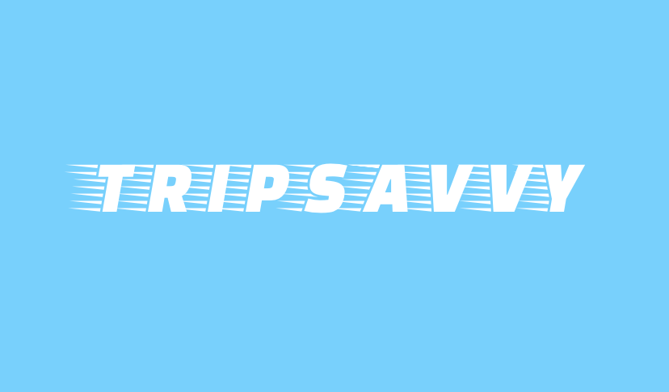
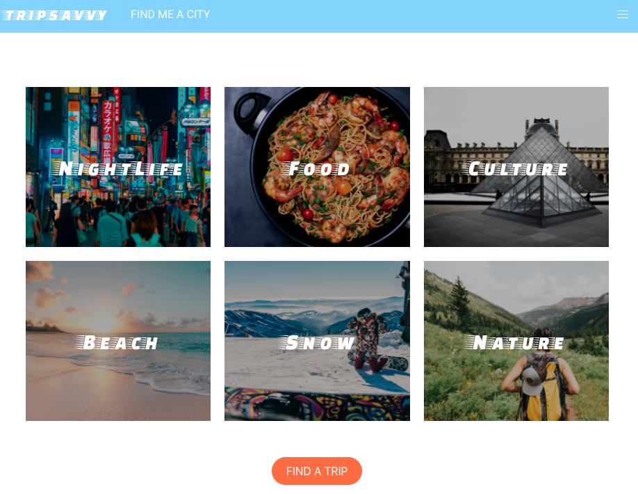
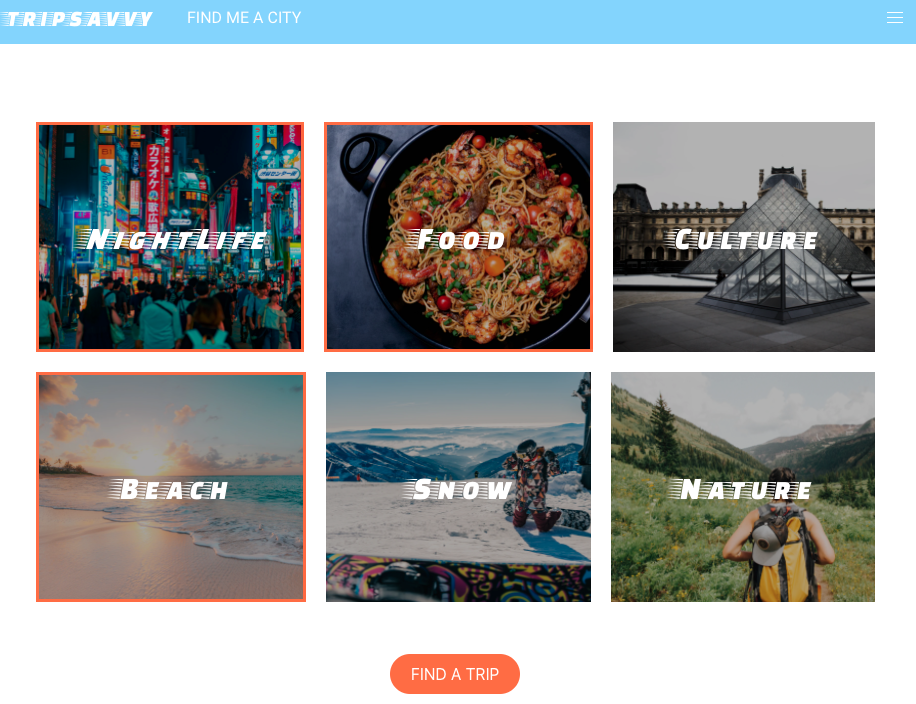
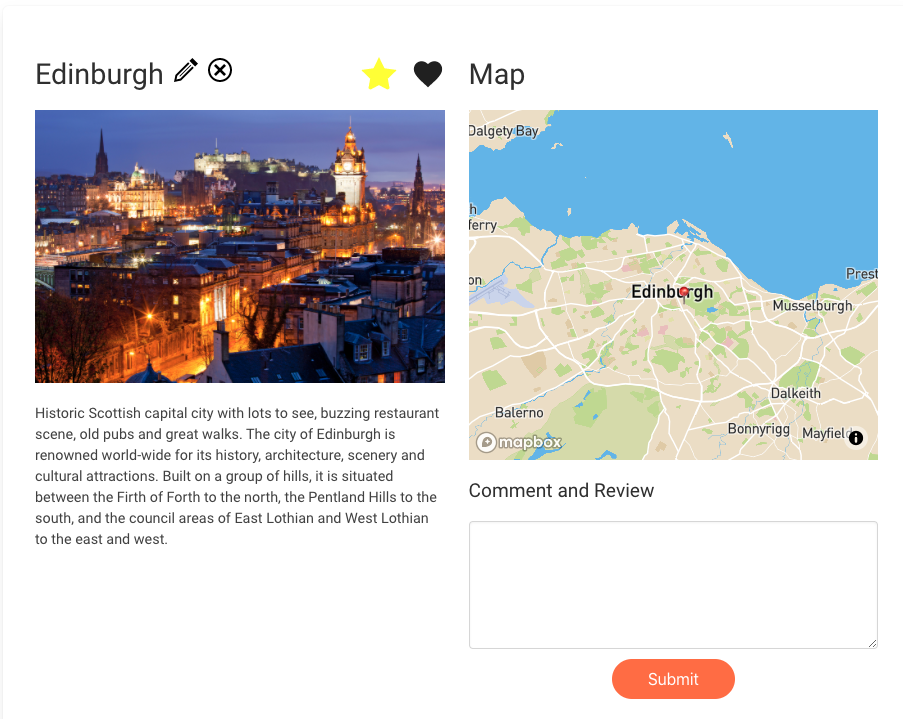
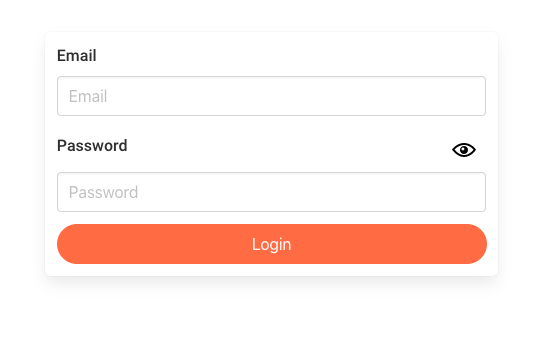
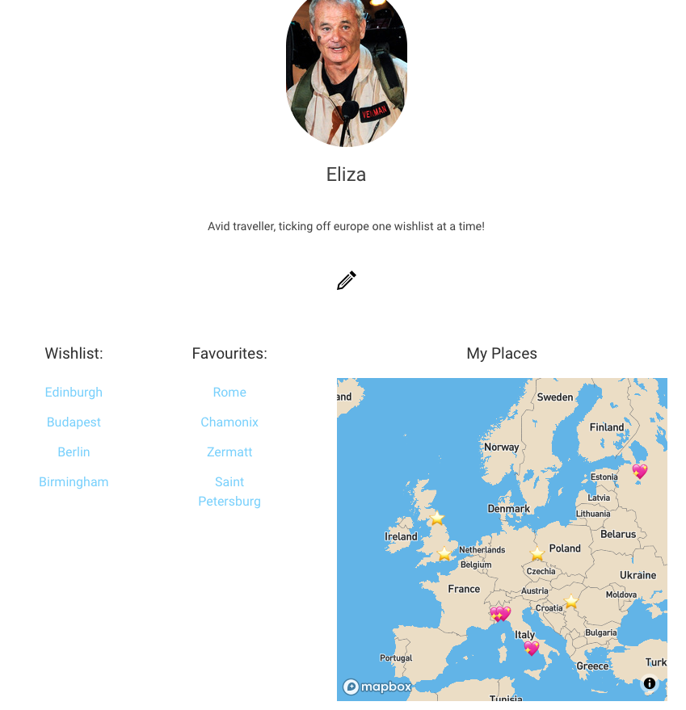
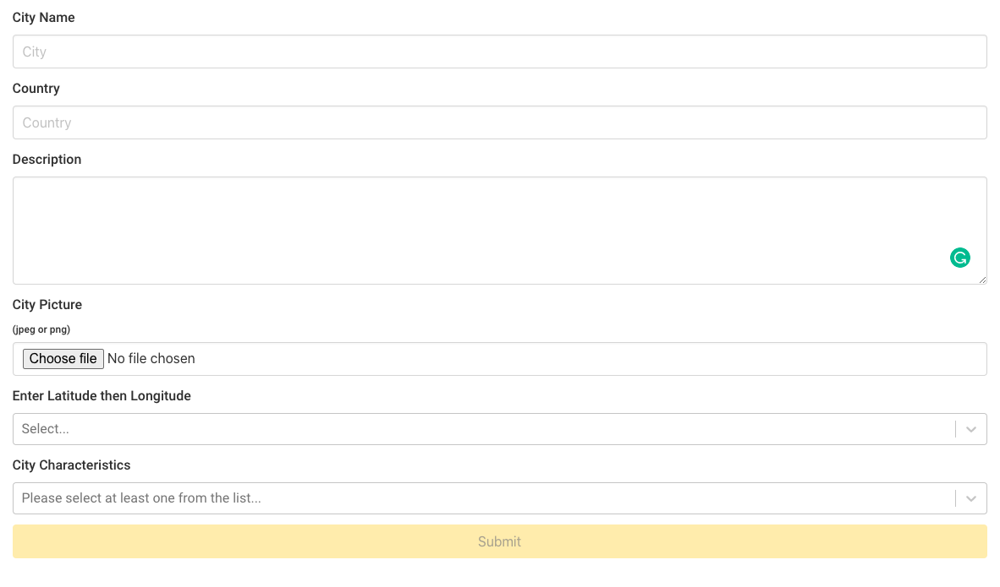

# Project #3: A MERN Stack App - TRIPSAVVY

## Timeframe
8 days  
3 person task  
## Technologies used:
•	JavaScript | React.js  
•	Node.js | Express | Mongoose   
•	CSS | Sass | Bulma   
•	GitHub | Insomnia  
•	Axios | Bcrypt | Toast | React-Router-Doms | jsonwebtoken | react-images-upload | react-notify-toast | react-select | react-map-gl  
## General Assembly Requirements:
* Build a full-stack application by making your own backend and your own front-end
* Use an Express API to serve your data from a Mongo database
* Consume your API with a separate front-end built with React
* Be a complete product which most likely means multiple relationships and CRUD functionality for at least a couple of models
* Implement thoughtful user stories/wireframes that are significant enough to help you know which features are core MVP and which you can cut
* Have a visually impressive design to kick your portfolio up a notch and have something to wow future clients & employers. **ALLOW** time for this.
* Be deployed online so it's publicly accessible.

  
## Idea (Inspire trip, Grad trip, Take a Trip, TripSavvy)
- A European (with potential to include other continents) trip planner travel app,
    - For people who want some inspiration on where to go,
    - Selects a random city from an initial filter based on certain predefined user search criteria (i.e. 'hot', 'culture'),
    - Idea inspired from 'Luckytrip' app ([https://luckytrip.co.uk/](https://luckytrip.co.uk/))
## Website Overview
Tripsavvy was curated to help keen travellers who cannot decide where they would like to go. The app allows users to to select attributes they would like from their holiday and then they will be recommended a place to visit.
  
Our Idea was inspired from the 'Luckytrip' app ([https://luckytrip.co.uk/](https://luckytrip.co.uk/)),
  
## Website Details
1.	On loading the website takes you to a slash page with our logo, and then users click through to a home page where they can select attributes for their holiday.
### Splash

### Home page

  
2.	Then once the user has selected their attributes and been recommended a trip they're taken to a show page for the city. This has a map showing where the city is, a picture and some details about the city. The user can register and login to unlock more features on the site. Members can 'favourite' or 'wishlist' cities that they like and know or that they like and want to visit. Further members can leave comments/recommendations on cities which will be shown to other users.
### City Page logged in and creator of city

### Login

  
3.	Members have profiles. On their profiles it shows cities they have favourited and wish listed both as lists of links they can click to visit that city page but also on a map showing the different locations of the cities.
### Profile Page

  
4.	Users are able to add cities to the database too and then edit and delete the cities they have created.
### Add city form

  
## Process
The starting point for this website was planning our website layout and the models for the backend. We made basic wireframes for the layout with AdobeXD. Whilst planning we also created a Trello board which broke down the challenge of our first full stack app into manageable chunks and written out on 'cards'. This allowed us to assign tasks to members of the team, communicate well and monitor our progress.
### Wireframes

  
We then focused on creating the models in the back end, using Insomnia check our work as we went along. To create the back end we mostly spent our time pair-coding to make sure when you had to refer to the models later on were were all very clear on the terms used and the structures built.
Wireframes:
### Home page wireframe
    Home Page wireframe:
    
### Show page wireframe
    'Show' Page wireframe:
    
### Profile page wireframe
    Profile Page wireframe:
    
  
Once the Backend was built we turned our attention to building our React.js frontend. We split up the workload and the time spent pair coding the difficult tasks rotating who was working with who.
Our MVP included:
* A homepage with some basic filters in the style of images (functions as a checkbox) that will search the Database with a few initial city records (i.e. 4/5) and present back a 'Show city' Card containing information about the city,
  - Within the 'Show' page, there will be added functionality for registered and logged in users, where they can add a city to their 'favourites' and/or 'wishlists'
* There will also be added functionality, to allow users to register and login to their account on the application,
  - For the Back-End side, the Database initially consisted of 2 models, one for the cities, one for the users that will registering and signing into the application.
  
I to a lead on creating the home page and the functionality required to recommend a city to the user and also the functionality of user 'favourites' and 'wishlists'
  
We set up our day in morning stand-up where we outlined what we wanted to achieve that day, and who would take on what task (updating our troll board), with rough time limits. We often started with the more complex tasks, and 2 of us would pair code them. and the other would work on another section of the site. We communicated throughout the day (using slack and zoom, as we were working remotely) and ultimately reached our MVP on time, this allowed us to add nice-have-features such as the local weather for the city and general styling. This also ensured a smooth UX.
  
### Wins
Creating favourites and wishlists. This was something we had not done previously.
  
### Challenges
We had to change the structure of our data to get the recommendation of the city to work from our attributes form on the home page. We changed the attributes from each being individual booleans to being a single array that we could use methods like map, every and filter on.
  
### Future features
* Add things to the map -> restaurants etc
* More of a user community, with maybe friend functionality and chat capabilities. Maybe allow users to see where other profiles have been? Message other people that have been to one of your wishlisted cities for advice.
